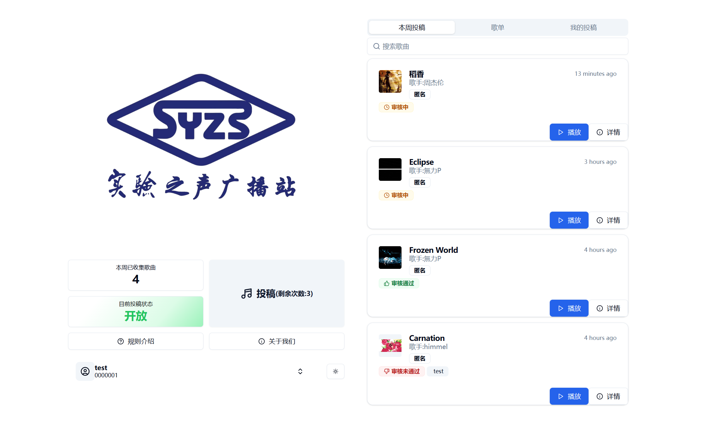
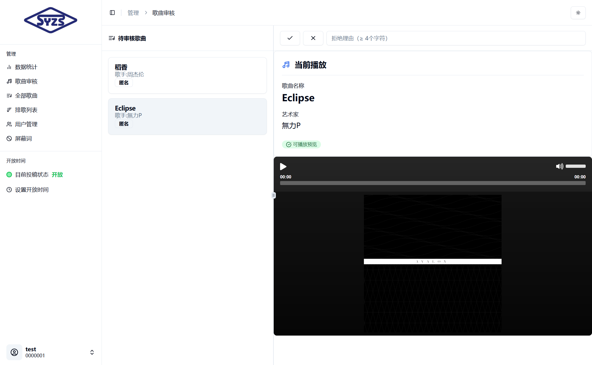

<p align="center">
  <a href="https://syzsgbz.dynv6.net/" target="_blank" rel="noopener noreferrer">
    
  </a>
</p>

<h1 align="center">实验之声广播站点歌系统</h1>

<p align="center">一个基于 Nuxt & Vue 开发的校园点歌系统</p>
<p align="center">
  <a href="https://nuxt.com"></a>
  
</p>

## 说明

本项目基于[SMS-COSMO/the1068fm](https://github.com/SMS-COSMO/the1068fm)的[v2.0.1](https://github.com/SMS-COSMO/the1068fm/releases/tag/v2.0.1)版本进行二次开发，非常感谢该项目带给开发者的灵感和项目基础架构

所用技术栈：

- Nuxt 3
- Vue 3
- TRPC


主要功能：

- 用户管理
- 歌曲审核
- 歌曲投稿&排歌
- 歌曲在线播放
- 歌曲数据批量导出

### 歌曲CSV数据导出支持

从 v2.0.1 起支持 CSV数据导出，内容包括歌曲名(name),作曲家(creator),音源(source),歌曲ID(songID)，你可以使用此功能获取批量歌曲的数据进行统计

若你想自己更改导出数据，可修改`app\pages\admin\arrange.vue`内逻辑

### 歌曲播放支持

从 v2.0.1 起，网站可以无需跳转第三方网站即可播放歌曲，本项目的歌曲播放器使用[nuxt-musicfyplayer](https://github.com/Yizack/nuxt-musicfyplayer)项目


## 用户界面

<p></p>
<p></p>
<p></p>

## 使用方法
将本项目源代码克隆至本地，或下载release文件后解压，在文件目录内运行

```bash
pnpm install
pnpm run dev
```

## 可使用脚本:

1. `dev`: 启动开发环境
2. `build`: 构建生产环境
3. `db:push`: 将架构更改推送到数据库
4. `auth:genKey`: 生成公钥和私钥

## 自定义音乐源：
Step 1：定义音乐数据解析逻辑  
在路径 `server/utils/song.ts` 文件中新增你的专属音乐源解析函数：  

#### 📌 数据格式要求  
返回值必须严格遵守以下类型定义：  
```typescript
interface MusicData {
  id: string;         //  音乐标识符
  name: string;       //  曲目名称
  artists: string;    //  艺术家信息  
  album?: string;     //  专辑名称（非必填）
  source: string;     //  源名称
  imgId: string;      //  封面图标识符（用于获取缩略图）
  duration: number;   //  时长（单位：s）
}
```

Step 2：在搜索接口注入新数据源  
请打开 TRPC 路由配置文件 `server/trpc/routers/search.ts`，在`mixSearch`和`mixGetUrl`API中添加自定义源逻辑

## 项目协议

本项目基于 [GPL v3](./LICENSE) 许可证发行，以下协议是对于 GPL v3 的补充，如有冲突，以以下协议为准。

---

*词语约定：本协议中的“本项目”指 Sound of Experiment（Voice of SZSY）项目；“使用者”指签署本协议的使用者；“官方音乐平台”指对本项目内置的包括网易云，QQ等音乐源的官方平台统称；“版权数据”指包括但不限于图像、音频、名字等在内的他人拥有所属版权的数据。*

### 一、数据来源

1.1 本项目的各官方平台在线数据来源原理是从其公开服务器中拉取数据（与未登录状态在官方平台 APP 获取的数据相同），经过对数据简单地筛选与合并后进行展示，因此本项目不对数据的合法性、准确性负责。

1.2 本项目使用的在线音频数据来源来自项目配置文件内设置的内置源（来自公开服务器数据，与未登录状态在官方平台 APP 获取的数据相同）和自定义源返回的在线链接，仅用于判断歌曲是否正确选择。若源返回了一个链接，则本项目将认为这就是该歌曲的音频数据而进行使用，至于这是不是正确的音频数据本项目无法校验其准确性，所以使用本项目的过程中可能会出现希望播放的音频与实际播放的音频不对应或者无法播放的问题。

1.3 本项目的非官方平台数据来自使用者本地系统或者使用者自行设置的自定义源，本项目不对这些数据的合法性、准确性负责。

### 二、版权数据

2.1 使用本项目的过程中可能会产生版权数据。对于这些版权数据，本项目不拥有它们的所有权。为了避免侵权，使用者务必在 **24 小时内** 清除使用本项目的过程中所产生的版权数据。

### 三、资源使用

3.1 本项目内使用的部分包括但不限于图片，音频等资源来源于互联网。如果出现侵权可联系本项目移除。

### 四、免责声明

4.1 由于使用本项目产生的包括由于本协议或由于使用或无法使用本项目而引起的任何性质的任何直接、间接、特殊、偶然或结果性损害（包括但不限于因商誉损失、停工、计算机故障或故障引起的损害赔偿，或任何及所有其他商业损害或损失）由使用者负责。

### 五、使用限制

5.1 本项目完全免费，且开源发布于 GitHub 面向全世界人用作对技术的学习交流。本项目不对项目内的技术可能存在违反当地法律法规的行为作保证。

5.2 **禁止在违反当地法律法规的情况下使用本项目。** 对于使用者在明知或不知当地法律法规不允许的情况下使用本项目所造成的任何违法违规行为由使用者承担，本项目不承担由此造成的任何直接、间接、特殊、偶然或结果性责任。

### 六、版权保护

6.1 音乐平台不易，请尊重版权，支持正版。

### 七、接受协议

7.1 若你使用了本项目，即代表你接受本协议。

---

## 致谢
1. [SMS-COSMO/the1068fm](https://github.com/SMS-COSMO/the1068fm)
2. [copws/qq-music-api](https://github.com/copws/qq-music-api)
3. [Yizack/nuxt-musicfyplayer](https://github.com/Yizack/nuxt-musicfyplayer)

## 贡献者
<a href="https://github.com/ljk743121/Sound-of-experiment/graphs/contributors">
  
</a>

## 项目版权
[GPL v3](./LICENSE) &copy; 2025 Sound of Experiment contributors