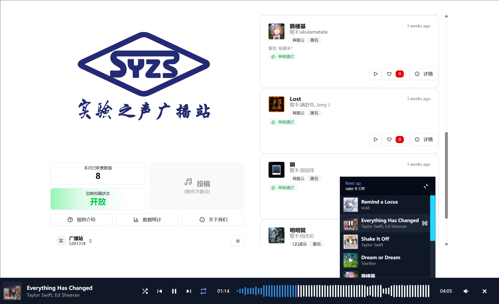
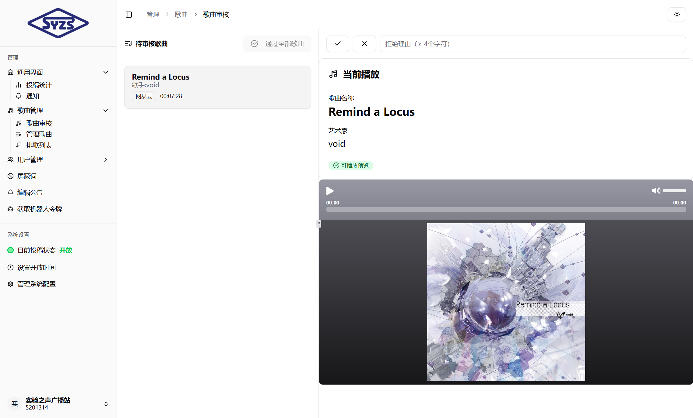
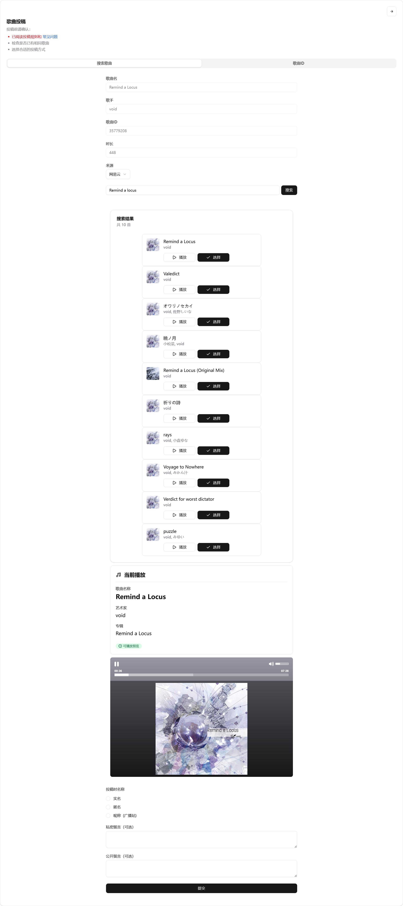

<p align="center">
  <a href="https://syzsgbz.dynv6.net/" target="_blank" rel="noopener noreferrer">
    
  </a>
</p>

<h1 align="center">Voice of SZSY</h1>
<h2 align="center">实验之声广播站点歌系统</h2>

<p align="center">一个基于 Nuxt & Vue 开发的校园点歌系统</p>
<p align="center">
  <a href="https://nuxt.com"></a>
  
</p>

## 说明

**更详细文档请参考[Docs](https://voszsy.netlify.app)**

所用技术栈：

- Nuxt 3
- Vue 3
- TRPC
- Drizzle ORM
- PostgreSQL
- Tailwind CSS
- shadcn-vue

主要功能：

- 用户管理（创建、编辑权限、重置密码等）
- 注册信息验证
- 歌曲审核系统
- 歌曲投稿&自动排歌
- 管理员手动排歌
- 歌曲在线播放（无需跳转第三方网站）
- 自定义音源插件
- 歌曲数据批量导出
- 机器人自动获取排歌信息
- 公告管理
- 敏感词管理+AI敏感词过滤
- 投稿时段设置
- 暗黑模式支持

### 歌曲CSV数据导出支持

从 v2.0.1 起支持 CSV数据导出，内容包括歌曲名(name),作曲家(creator),音源(source),歌曲ID(songID)，你可以使用此功能获取批量歌曲的数据进行统计

若你想自己更改导出数据，可修改`app\pages\admin\songs\arrange.vue`内逻辑

### 歌曲播放支持

从 v2.0.1 起，网站可以无需跳转第三方网站即可播放歌曲，本项目的歌曲播放器使用[nuxt-musicfyplayer](https://github.com/Yizack/nuxt-musicfyplayer)(投稿和审核界面)以及[@ljk743121/vue-music-flow](https://github.com/ljk743121/vue-music-flow)(主界面)(v2.3.0开始使用)

## 用户界面

图片为v2.3.0版本

<p></p>
<p></p>
<p></p>

## 项目初始化

首次使用时，建议运行初始化脚本以配置基本环境：

```bash
pnpm install
pnpm run postinstall
pnpm run init
```

`pnpm run init`会初始化项目环境，包括：

- 更新数据库schema
- 检测和配置环境变量
- 配置会话密码(NUXT_SESSION_PASSWORD)
- 生成公钥和私钥
- 配置config数据表
- 检测认证api是否存在

再启动开发服务器：

```bash
pnpm run dev
```

## 可使用脚本:

1. `init`: 运行项目初始化脚本
2. `dev`: 启动开发环境
3. `build`: 构建生产环境
4. `postinstall`: 项目安装后自动执行（Nuxt准备）
5. `preview`: 预览生产环境构建
6. `db:push`: 将架构更改推送到数据库
7. `db:studio`: 启动Drizzle Studio数据库管理界面
8. `auth:genKey`: 生成公钥和私钥
9. `user:admin`: 创建管理员用户
10. `user:robot`: 创建机器人用户
11. `lint`: 运行ESLint检查
12. `lint:fix`: 自动修复ESLint问题
13. `lint:lint-staged`: 对暂存文件运行ESLint
14. `lint:format`: 使用Prettier格式化代码
15. `husky:prepare`: 初始化Husky Git钩子

## 自定义音乐源：

项目使用插件系统管理不同的音乐源。要添加自定义音乐源，请按照以下步骤操作：

### Step 1：创建音乐源插件

在`shared/plugins/`目录中创建一个新的TypeScript文件（例如`MyMusicSource.ts`），实现音乐源插件：

```typescript
// ...existing code

async function mySearchSongs(key: string): Promise<TSong[]> {
  // 实现搜索逻辑
  // 返回符合TSong类型的歌曲数组
}

async function getMusicUrl(id: string): Promise<{ url: string; pay: boolean }> {
  // 实现获取歌曲URL的逻辑
}

async function getMusicUrl2(id: string): Promise<{ url: string; pay: boolean }> {
  // 实现获取歌曲URL的逻辑
}
// ...

export const mysource = createPlugin({
  name: "your-plugin", // 唯一标识符
  alias: "我的音乐源", // 显示名称
  searchSongs: mySearchSongs,
  getMusicUrl: [
    { fn: getMusicUrl, priority: 1 },
    { fn: getMusicUrl2, priority: 0.9 },
    // ...其他获取URL函数，每个函数的priority值不同，数值越大优先级越高
  ],
});
```

### Step 2：注册音乐源插件

在`server/utils/plugins/index.ts`文件中导入并注册你的自定义插件：

```typescript
export * from "./MyMusicSource";
```

然后在`server/utils/plugins.ts`文件中添加你的插件：

```typescript
// ...existing code
pluginManager
  .use(plugins.netease)
  // ...
  .use(plugins.mysource); // 添加你的插件
```

### 📌 数据格式要求

自定义音乐源插件返回的歌曲数据必须严格遵守`TSong`类型定义：

```typescript
interface TSong {
  id: string; // 音乐标识符
  name: string; // 曲目名称
  artists: string; // 艺术家信息
  album?: string; // 专辑名称（非必填）
  source: TMediaSource; // 源名称
  imgId: string; // 封面图标识符（用于获取缩略图）
  duration: number; // 时长（单位：s）
}
```

## 项目协议

本项目基于 [GPL v3](./LICENSE) 许可证发行，以下协议是对于 GPL v3 的补充，如有冲突，以以下协议为准。

---

_词语约定：本协议中的"本项目"指 Sound of Experiment（Voice of SZSY）项目；"使用者"指签署本协议的使用者；"官方音乐平台"指对本项目内置的包括网易云，QQ等音乐源的官方平台统称；"版权数据"指包括但不限于图像、音频、名字等在内的他人拥有所属版权的数据。_

### 一、数据来源

1.1 本项目的各官方平台在线数据来源原理是从其公开服务器中拉取数据（与未登录状态在官方平台 APP 获取的数据相同），经过对数据简单地筛选与合并后进行展示，因此本项目不对数据的合法性、准确性负责。

1.2 本项目使用的在线音频数据来源来自项目配置文件内设置的内置源（来自公开服务器数据，与未登录状态在官方平台 APP 获取的数据相同）和自定义源返回的在线链接，仅用于判断歌曲是否正确选择。若源返回了一个链接，则本项目将认为这就是该歌曲的音频数据而进行使用，至于这是不是正确的音频数据本项目无法校验其准确性，所以使用本项目的过程中可能会出现希望播放的音频与实际播放的音频不对应或者无法播放的问题。

1.3 本项目的非官方平台数据来自使用者本地系统或者使用者自行设置的自定义源，本项目不对这些数据的合法性、准确性负责。

### 二、版权数据

2.1 使用本项目的过程中可能会产生版权数据。对于这些版权数据，本项目不拥有它们的所有权。为了避免侵权，使用者务必在 **24 小时内** 清除使用本项目的过程中所产生的版权数据。

### 三、资源使用

3.1 本项目内使用的部分包括但不限于图片，音频等资源来源于互联网。如果出现侵权可联系本项目移除。

### 四、免责声明

4.1 由于使用本项目产生的包括由于本协议或由于使用或无法使用本项目而引起的任何性质的任何直接、间接、特殊、偶然或结果性损害（包括但不限于因商誉损失、停工、计算机故障或故障引起的损害赔偿，或任何及所有其他商业损害或损失）由使用者负责。

### 五、使用限制

5.1 本项目完全免费，且开源发布于 GitHub 面向全世界人用作对技术的学习交流。本项目不对项目内的技术可能存在违反当地法律法规的行为作保证。

5.2 **禁止在违反当地法律法规的情况下使用本项目。** 对于使用者在明知或不知当地法律法规不允许的情况下使用本项目所造成的任何违法违规行为由使用者承担，本项目不承担由此造成的任何直接、间接、特殊、偶然或结果性责任。

### 六、版权保护

6.1 音乐平台不易，请尊重版权，支持正版。

### 七、接受协议

7.1 若你使用了本项目，即代表你接受本协议。

---

## 致谢

1. [SMS-COSMO/the1068fm](https://github.com/SMS-COSMO/the1068fm) 本项目基于该项目的[v2.0.1](https://github.com/SMS-COSMO/the1068fm/releases/tag/v2.0.1)版本进行二次开发
2. [copws/qq-music-api](https://github.com/copws/qq-music-api)
3. [Yizack/nuxt-musicfyplayer](https://github.com/Yizack/nuxt-musicfyplayer)
4. [ndragun92/vue-music-flow](https://github.com/ndragun92/vue-music-flow) 本项目使用的音乐播放组件[@ljk743121/vue-music-flow](https://github.com/ljk743121/vue-music-flow)基于其二次开放
5. [api.vkeys.cn](https://api.vkeys.cn) 本项目使用的第三方音乐源接口
6. [api.qijieya.cn](https://api.qijieya.cn) 本项目使用的第三方音乐源接口

## 贡献者

<a href="https://github.com/ljk743121/Sound-of-experiment/graphs/contributors">
  
</a>

## 项目版权

[GPL v3](./LICENSE) &copy; 2025 Sound of Experiment contributors
