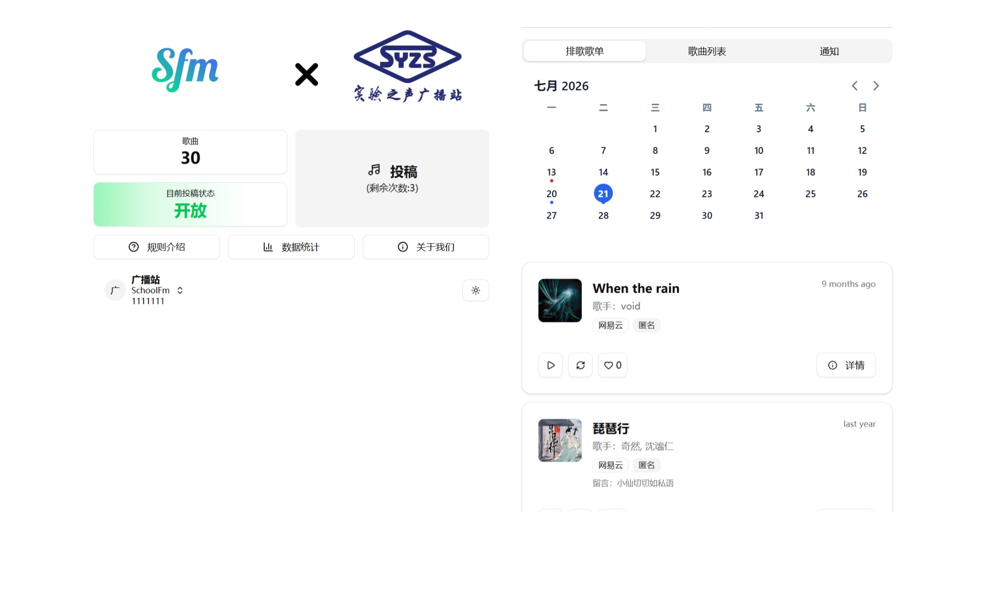
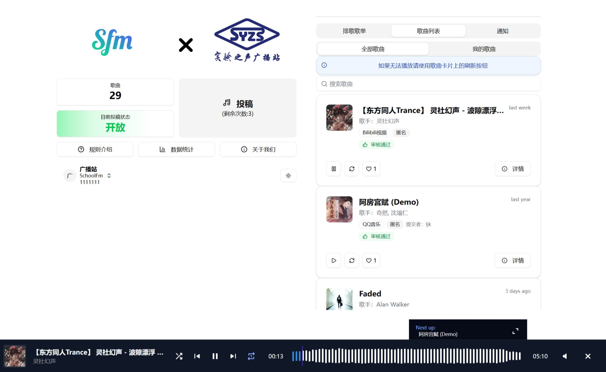
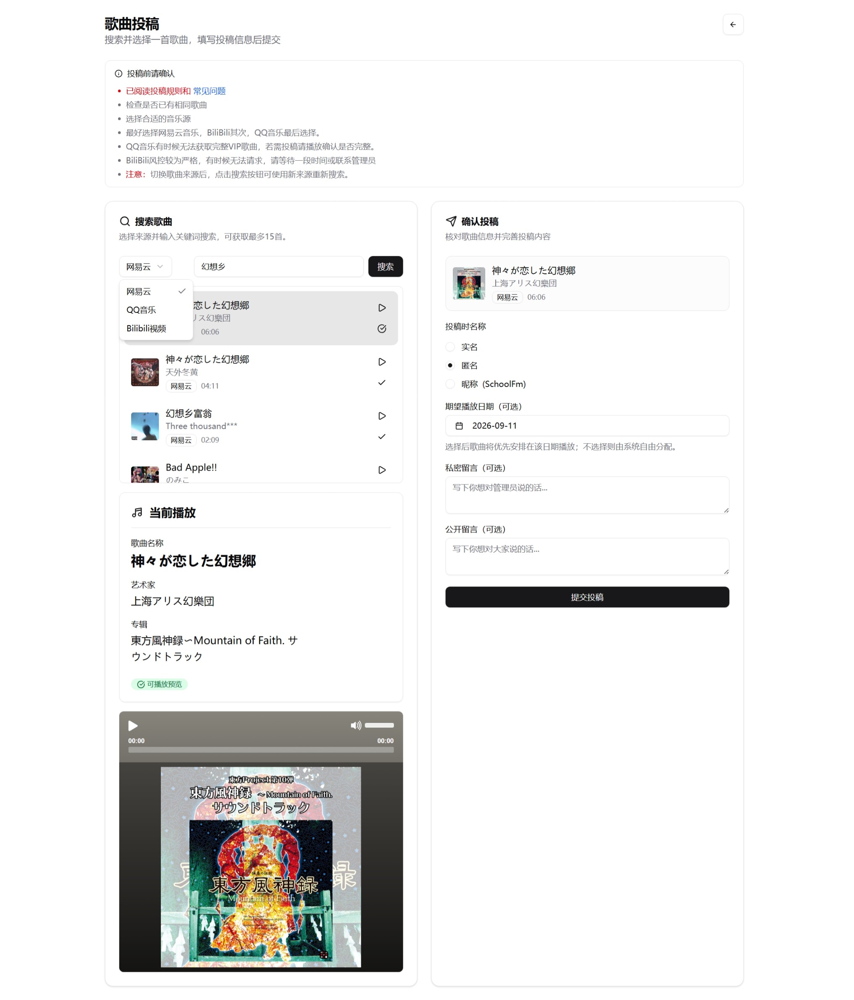
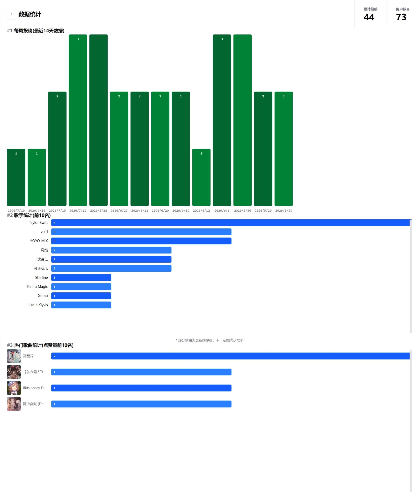
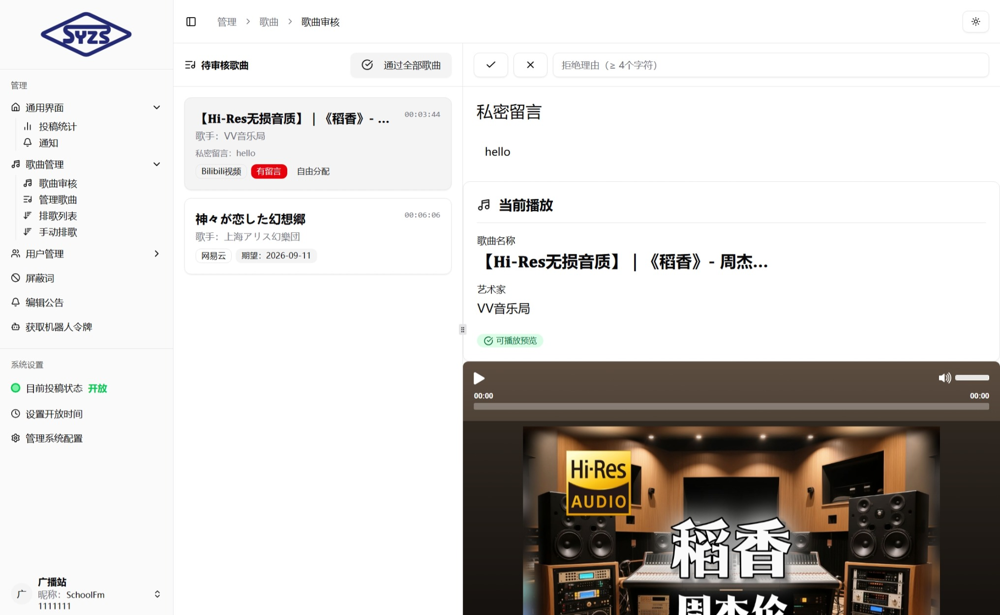
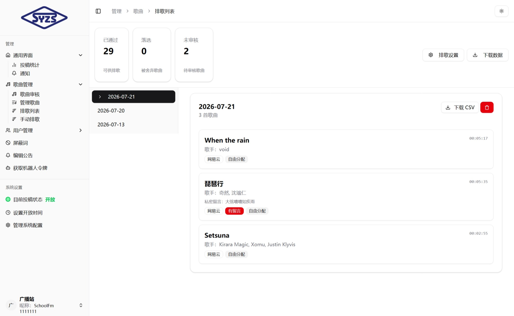
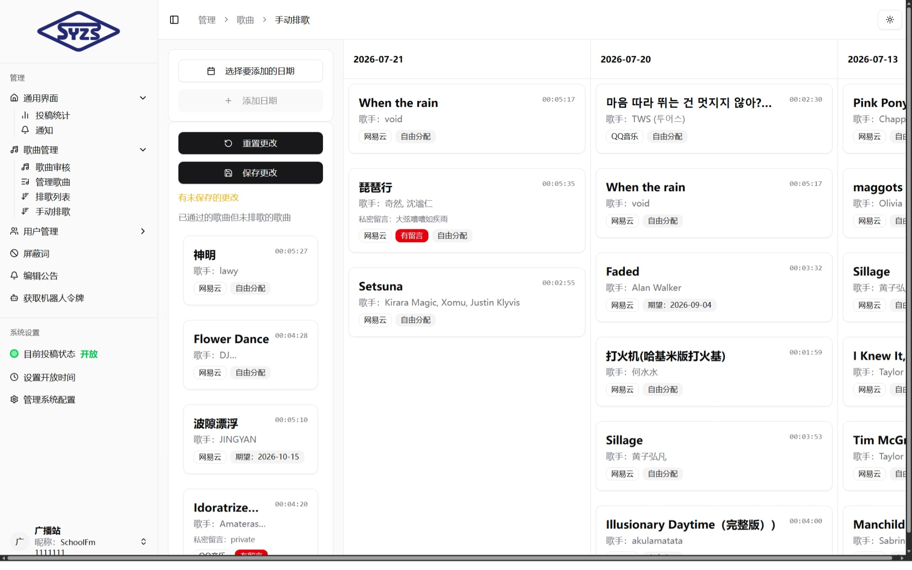
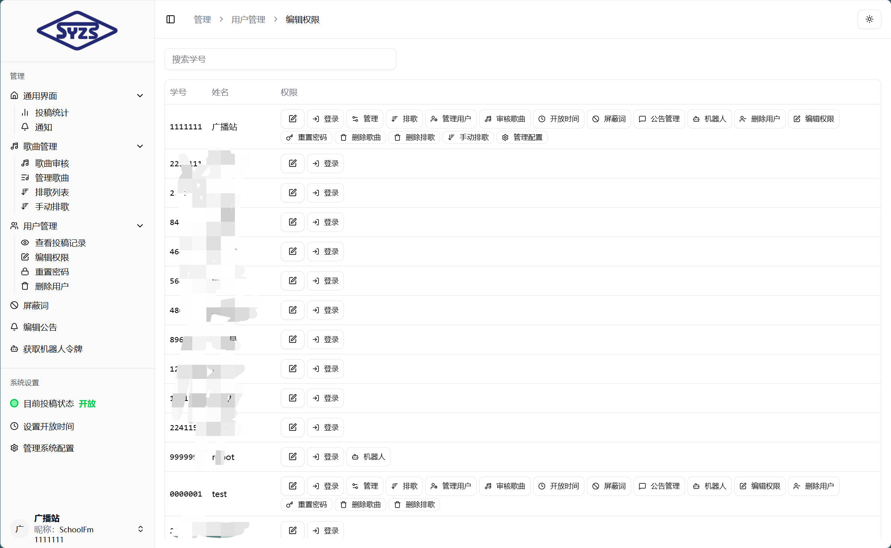

<p align="center">
  <a href="https://voszsy.penacony.cn/" target="_blank" rel="noopener noreferrer">
    
  </a>
</p>

<h1 align="center">SchoolFm</h1>

<p align="center">一个基于 Nuxt & Vue 开发的校园点歌管理播放一体化自动化系统</p>
<p align="center" style="font-style: italic;">曾用名：Sound of Experiment；Voice of SZSY</p>
<p align="center">
  <a href="https://nuxt.com"></a>
  
</p>

## 说明

更详细文档请参考 [Docs](https://ljk743121.github.io/soeDoc) (可能未更新)

### 所用技术栈

- Nuxt 3
- Vue 3
- tRPC
- Drizzle ORM
- PostgreSQL
- Tailwind CSS v4
- shadcn-vue
- Redis（可选，用于缓存）
- Vitest

### 主要功能

- 用户管理（创建、编辑权限、重置密码、删除用户等）
- 注册信息验证（支持可选的学校认证接口）
- 歌曲审核系统
- 歌曲投稿与自动排歌
- 管理员手动排歌
- 投稿时可选择期望播放日期
- 歌曲在线播放（无需跳转第三方网站）
- 自定义音源插件
- 歌曲数据批量导出（CSV）
- 机器人自动获取排歌信息
- 放歌完成监控与外部脚本上报
- 公告管理（首页展示 + 管理后台）
- 敏感词管理 + AI 敏感词过滤
- 投稿时段设置
- 数据统计面板
- 常见问题（FAQ）页面
- 歌曲点赞显示（显示点赞数及点赞人）
- 暗黑模式支持

### v2.4.0 主要更新

- 新增「期望播放日期」：投稿时可选择期望日期，系统排歌时优先安排
- 更新「常见问题（FAQ）」页面
- 更新首页和管理页面信息展示，优化操作逻辑和用户体验
- 新增放歌完成监控配置与 `arrangements.hasPlayed` 接口
- Redis 改为可选依赖，未配置时自动降级为直连数据库
- 每日播放总时长限制调整为 **45 分钟**
- 排歌优先级：**期望日期 > 投稿时间（早投稿优先）**

### 歌曲 CSV 数据导出

项目支持 CSV 数据导出，内容包括 `id`、`name`（歌曲名）、`creator`（作曲家/艺术家）、`source`（音源）、`songID`（歌曲 ID）。你可以使用此功能获取批量歌曲数据进行统计或与其他系统对接。

导出入口：

- 管理后台 **排歌列表** 页面：按日期下载单天排歌 CSV
- 管理后台 **排歌列表** 页面「下载数据」：按日期区间导出 CSV
- 外部脚本 [`externalScripts/fetch_today.py`](./externalScripts/fetch_today.py)：自动获取当天排歌并保存为 CSV

若需自定义导出字段或格式，可修改 [`app/pages/admin/songs/arrange.vue`](./app/pages/admin/songs/arrange.vue) 与 [`app/components/admin/song/DownloadControls.vue`](./app/components/admin/song/DownloadControls.vue) 中的相关逻辑。

### 歌曲播放支持

网站无需跳转第三方网站即可播放歌曲。播放器使用：

- 投稿与审核界面：[nuxt-musicfyplayer](https://github.com/Yizack/nuxt-musicfyplayer)
- 主界面：<del>[@ljk743121/vue-music-flow](https://github.com/ljk743121/vue-music-flow)</del>（v2.3.0 起使用，v2.4.2起弃用）
  使用重构后的播放器组件，参考[XiangZi7/GlassMusicPlayer](https://github.com/XiangZi7/GlassMusicPlayer)

### 外部脚本

##### 注意：脚本由AI编写，仅进行简要测试，可能会有bug

项目提供 Python 辅助脚本，位于 [`externalScripts/`](./externalScripts/) 目录，用于与机器人/放歌流程对接：

| 脚本                                                   | 说明                                                                                | 依赖                   |
| ------------------------------------------------------ | ----------------------------------------------------------------------------------- | ---------------------- |
| [`fetch_today.py`](./externalScripts/fetch_today.py)   | 调用 `arrangements.today` 接口获取当天排歌，导出为 CSV                              | `pip install requests` |
| [`has_played.py`](./externalScripts/has_played.py)     | 读取 CSV 歌曲列表，登录后批量上报 `arrangements.hasPlayed`                          | `pip install requests` |
| [`missed_dates.py`](./externalScripts/missed_dates.py) | 检查区间内服务器有排歌但本地未下载的日期，并上报未播放为 `missed`；支持本地增量缓存 | `pip install requests` |

使用示例：

```bash
# 获取当天排歌
python externalScripts/fetch_today.py --base-url https://voszsy.penacony.cn

# 上报当天已播放（需在后台开启「监控是否完成放歌任务」）
python externalScripts/has_played.py songs_2026-07-19.csv \
  --base-url https://voszsy.penacony.cn \
  --user-id 你的学号 \
  --password 你的密码

# 检查 2026-07-20 至 2026-07-31 的漏跑日期（需开启「监控是否完成放歌任务」；此例不实际上报）
python externalScripts/missed_dates.py \
  --base-url https://voszsy.penacony.cn \
  --user-id 你的学号 \
  --password 你的密码 \
  --csv-dir externalScripts \
  --cache-path externalScripts/arrangement_cache.json \
  --start 2026-07-20 \
  --end 2026-07-31 \
  --dry-run
```

## 用户界面

图片为 v2.4.0 版本：
(图一为v2.4.2版本)

<!-- <p></p> -->
<p></p>
<p></p>
<p></p>
<p></p>
<p></p>
<p></p>
<p></p>

## 项目初始化

首次使用时，建议运行初始化脚本以配置基本环境：

```bash
pnpm install
pnpm run postinstall
pnpm run init
```

`pnpm run init` 会初始化项目环境，包括：

- 从 `.env.example` 创建 `.env`（若不存在）
- 更新数据库 schema
- 检测和配置环境变量
- 配置会话密码（`NUXT_SESSION_PASSWORD`）
- 生成公钥和私钥
- 配置 config 数据表

再启动开发服务器：

```bash
pnpm run dev
```

## 可使用脚本

1. `init`：运行项目初始化脚本
2. `dev`：启动开发环境
3. `build`：构建生产环境
4. `generate`：生成静态站点
5. `preview`：预览生产环境构建
6. `postinstall`：项目安装后自动执行（Nuxt 准备）
7. `typecheck`：运行 TypeScript 类型检查
8. `db:push`：将架构更改推送到数据库
9. `db:studio`：启动 Drizzle Studio 数据库管理界面
10. `db:seed`：向数据库填充示例数据
11. `db:reset`：重置数据库（谨慎使用）
12. `auth:genKey`：生成公钥和私钥
13. `user:admin`：创建管理员用户
14. `user:robot`：创建机器人用户
15. `lint`：运行 ESLint 检查
16. `lint:fix`：自动修复 ESLint 问题
17. `lint:lint-staged`：对暂存文件运行 ESLint
18. `lint:format`：使用 Prettier 格式化代码
19. `husky:prepare`：初始化 Husky Git 钩子
20. `test`：运行 Vitest 单元测试

## 环境变量说明

项目通过 `.env` 文件管理环境变量，首次初始化前请至少填写以下必填项：

| 变量                                   | 必填 | 说明                                                          |
| -------------------------------------- | ---- | ------------------------------------------------------------- |
| `DATABASE_URL`                         | 是   | PostgreSQL 数据库连接地址                                     |
| `DATABASE_URL_DEV`                     | 否   | 开发环境数据库连接地址（可选）                                |
| `DB_ENV`                               | 否   | `production` 或 `development`，默认 `production`              |
| `REDIS_URL`                            | 否   | Redis 连接地址，未配置则不启用缓存                            |
| `NUXT_SESSION_PASSWORD`                | 是   | 会话加密密码，`pnpm run init` 可自动生成                      |
| `SIGN_PUBLIC_KEY` / `SIGN_PRIVATE_KEY` | 是   | JWT 签名密钥对，`auth:genKey` 生成                            |
| `ENC_PUBLIC_KEY` / `ENC_PRIVATE_KEY`   | 是   | JWT 加密密钥对，`auth:genKey` 生成                            |
| `SIGN_KID` / `ENC_KID`                 | 是   | 密钥 ID，`auth:genKey` 生成                                   |
| `USER_API_CONFIG`                      | 否   | 学校注册认证接口配置 JSON（仅用于深圳实验学校认证，不需配置） |

## 自定义音乐源

项目使用插件系统管理不同的音乐源。要添加自定义音乐源，请按照以下步骤操作：

### Step 1：创建音乐源插件

在 [`server/utils/plugins/`](./server/utils/plugins/) 目录中创建一个新的 TypeScript 文件（例如 `MyMusicSource.ts`），实现音乐源插件：

```typescript
// ...existing code

async function mySearchSongs(key: string): Promise<TSong[]> {
  // 实现搜索逻辑
  // 返回符合 TSong 类型的歌曲数组
}

async function getMusicUrl(id: string): Promise<{ url: string; pay: boolean }> {
  // 实现获取歌曲 URL 的逻辑
}

async function getMusicUrl2(id: string): Promise<{ url: string; pay: boolean }> {
  // 实现获取歌曲 URL 的逻辑
}
// ...

export const mysource = createPlugin({
  name: "your-plugin", // 唯一标识符
  alias: "我的音乐源", // 显示名称
  searchSongs: mySearchSongs,
  getMusicUrl: [
    { fn: getMusicUrl, priority: 1 },
    { fn: getMusicUrl2, priority: 0.9 },
    // ...其他获取 URL 函数，每个函数的 priority 值不同，数值越大优先级越高
  ],
});
```

### Step 2：注册音乐源插件

在 [`server/utils/plugins/index.ts`](./server/utils/plugins/index.ts) 文件中导出你的自定义插件：

```typescript
export * from "./MyMusicSource";
```

然后在 [`server/utils/plugin.ts`](./server/utils/plugin.ts) 文件中添加你的插件：

```typescript
// ...existing code
pluginManager.use(plugins.netease).use(plugins.qqmusic).use(plugins.bilibili).use(plugins.mysource); // 添加你的插件
```

### 📌 数据格式要求

自定义音乐源插件返回的歌曲数据必须严格遵守 `TSong` 类型定义：

```typescript
interface TSong {
  id: string; // 音乐标识符
  name: string; // 曲目名称
  artists: string; // 艺术家信息
  album?: string; // 专辑名称（非必填）
  source: TMediaSource; // 源名称
  imgId: string; // 封面图标识符（用于获取缩略图）
  duration: number; // 时长（单位：s）
}
```

### ⏳ 重试机制

插件管理器自动为每个插件的 `searchSongs` 和 `getMusicUrl` 中的所有函数添加失败重试，无需在每个插件中单独实现。支持三级重试次数配置，优先级从高到低：

1. **函数级别** — 单独指定某个搜索或 URL 获取函数的重试次数
2. **插件级别** — 该插件所有函数使用同一个重试次数
3. **默认值** — 不配置时默认为 `5` 次

```typescript
export const mysource = createPlugin({
  name: "my-source",
  alias: "我的音源",
  retryCount: 3, // 插件级兜底：重试 3 次
  searchSongs: { fn: mySearchSongs, retryCount: 2 }, // 搜索只重试 2 次（覆盖插件级）
  getMusicUrl: [
    { fn: getMusicUrl, priority: 1, retryCount: 1 }, // 主链只重试 1 次
    { fn: getMusicUrl2, priority: 0.9 }, // 未设，使用插件级 3
    { fn: getMusicUrl3, priority: 0.8 }, // 未设，使用插件级 3
  ],
});
```

重试策略：每次失败后等待 `1s × 重试序号`，依次递增（1s, 2s, 3s...），每次重试时在控制台输出 `[插件名称] 函数名 failed (...). Retrying N/最大重试次数...`。

**注意：** 插件各函数正常抛错即可，`PluginManager.use()` 自动包裹重试逻辑，无需在插件实现中编写任何重试代码。

## 项目协议

本项目基于 [GPL v3](./LICENSE) 许可证发行，以下协议是对于 GPL v3 的补充，如有冲突，以以下协议为准。

---

_词语约定：本协议中的"本项目"指 SchoolFm项目；"使用者"指签署本协议的使用者；"官方音乐平台"指对本项目内置的包括网易云，QQ 等音乐源的官方平台统称；"版权数据"指包括但不限于图像、音频、名字等在内的他人拥有所属版权的数据。_

### 一、数据来源

1.1 本项目的各官方平台在线数据来源原理是从其公开服务器中拉取数据（与未登录状态在官方平台 APP 获取的数据相同），经过对数据简单地筛选与合并后进行展示，因此本项目不对数据的合法性、准确性负责。

1.2 本项目使用的在线音频数据来源来自项目配置文件内设置的内置源（来自公开服务器数据，与未登录状态在官方平台 APP 获取的数据相同）和自定义源返回的在线链接，仅用于判断歌曲是否正确选择。若源返回了一个链接，则本项目将认为这就是该歌曲的音频数据而进行使用，至于这是不是正确的音频数据本项目无法校验其准确性，所以使用本项目的过程中可能会出现希望播放的音频与实际播放的音频不对应或者无法播放的问题。

1.3 本项目的非官方平台数据来自使用者本地系统或者使用者自行设置的自定义源，本项目不对这些数据的合法性、准确性负责。

### 二、版权数据

2.1 使用本项目的过程中可能会产生版权数据。对于这些版权数据，本项目不拥有它们的所有权。为了避免侵权，使用者务必在 **24 小时内** 清除使用本项目的过程中所产生的版权数据。

### 三、资源使用

3.1 本项目内使用的部分包括但不限于图片，音频等资源来源于互联网。如果出现侵权可联系本项目移除。

### 四、免责声明

4.1 由于使用本项目产生的包括由于本协议或由于使用或无法使用本项目而引起的任何性质的任何直接、间接、特殊、偶然或结果性损害（包括但不限于因商誉损失、停工、计算机故障或故障引起的损害赔偿，或任何及所有其他商业损害或损失）由使用者负责。

### 五、使用限制

5.1 本项目完全免费，且开源发布于 GitHub 面向全世界人用作对技术的学习交流。本项目不对项目内的技术可能存在违反当地法律法规的行为作保证。

5.2 **禁止在违反当地法律法规的情况下使用本项目。** 对于使用者在明知或不知当地法律法规不允许的情况下使用本项目所造成的任何违法违规行为由使用者承担，本项目不承担由此造成的任何直接、间接、特殊、偶然或结果性责任。

### 六、版权保护

6.1 音乐平台不易，请尊重版权，支持正版。

### 七、接受协议

7.1 若你使用了本项目，即代表你接受本协议。

---

## 致谢

感谢[锦木祈杰](https://qijieya.cn/)为本项目提供的[二级域名](https://voszsy.penacony.cn)

1. [SMS-COSMO/the1068fm](https://github.com/SMS-COSMO/the1068fm) 本项目基于该项目的 [v2.0.1](https://github.com/SMS-COSMO/the1068fm/releases/tag/v2.0.1) 版本进行二次开发
2. [copws/qq-music-api](https://github.com/copws/qq-music-api) qq 音乐 API 参考
3. [Yizack/nuxt-musicfyplayer](https://github.com/Yizack/nuxt-musicfyplayer) 本项目使用的音乐播放组件
4. [ndragun92/vue-music-flow](https://github.com/ndragun92/vue-music-flow) 本项目使用的音乐播放组件 [@ljk743121/vue-music-flow](https://github.com/ljk743121/vue-music-flow) 基于其二次开发,v2.4.2起弃用
5. [XiangZi7/GlassMusicPlayer](https://github.com/XiangZi7/GlassMusicPlayer) 本项目使用的音乐播放组件参考其二次开发
6. [api.vkeys.cn](https://api.vkeys.cn) 本项目使用的第三方音乐源接口
7. [api.qijieya.cn](https://api.qijieya.cn) 本项目使用的第三方音乐源接口
8. [SocialSisterYi/bilibili-API-collect](https://github.com/SocialSisterYi/bilibili-API-collect) bilibili API 参考，于分支备份查看文档
9. [lyswwhut/lx-music-desktop](https://github.com/lywhut/lx-music-desktop) qq 音乐 API 修复参考

## 贡献者

若有意愿贡献代码，欢迎提交 Pull Request 到本项目的 GitHub 仓库。

<a href="https://github.com/ljk743121/Sound-of-experiment/graphs/contributors">
  
</a>

## 项目版权

[GPL v3](./LICENSE) &copy; 2025-2026 SchoolFm contributors
